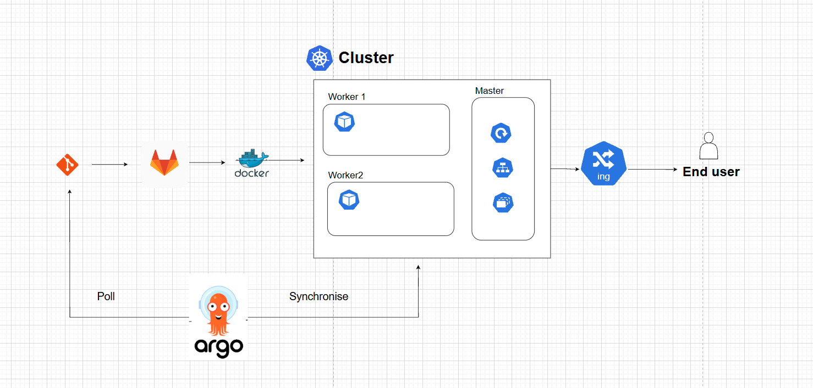
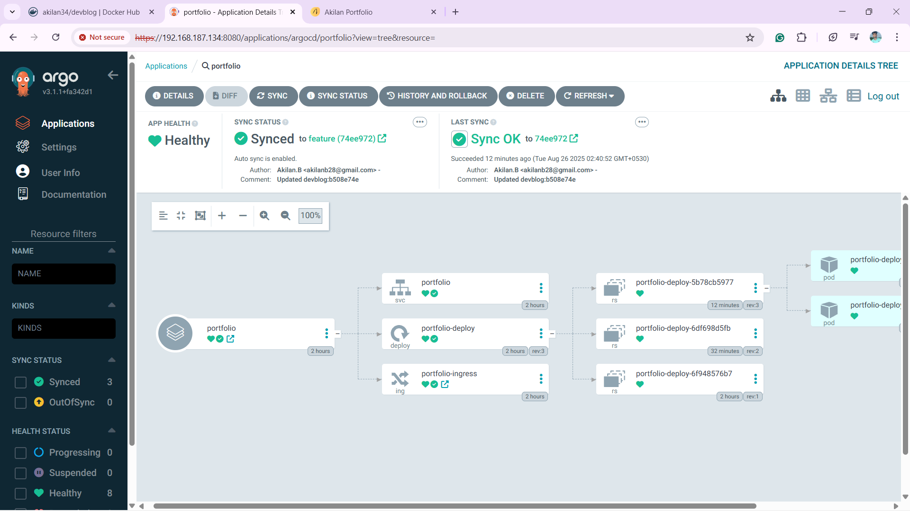
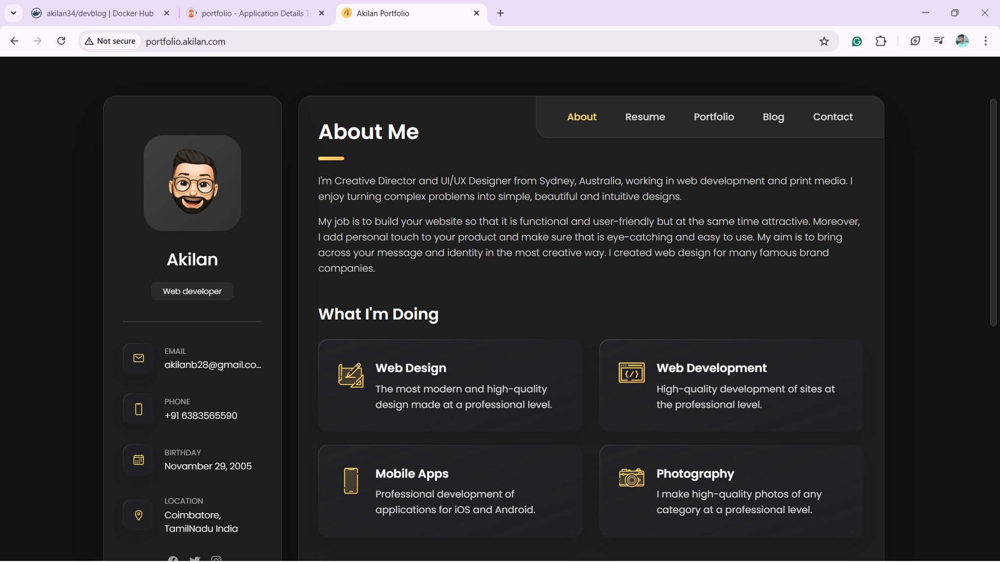

# DevBlog CI/CD with GitLab & ArgoCD

This project demonstrates a **CI/CD pipeline** for a containerized application (`DevBlog`) using **GitLab CI**, **Docker**, **Kubernetes**, and **ArgoCD**.  

The pipeline ensures:
1. **Build** → Docker image is built with a unique tag for every commit and pushed to **DockerHub**.  
2. **Test** → The image is pulled, a container is started, and basic health checks are performed.  
3. **Deploy** → Kubernetes `deployment.yaml` is updated automatically, and ArgoCD syncs the changes to the cluster.  

---

## 🔄 CI/CD Workflow

- **GitLab CI/CD** builds and tests Docker images.  
- Images are pushed to DockerHub → [`akilan34/devblog`](https://hub.docker.com/repository/docker/akilan34/devblog/general).  
- **Kubernetes manifests** are updated with the new image tag.  
- **ArgoCD** automatically detects changes and deploys them to the cluster.  

---

##  Flowchart

Below is the CI/CD flow for this project:

  

---
##  ArgoCD Pod View

This screenshot shows the **ArgoCD-managed application pods** running inside Kubernetes:

  

---
##  Output

Below is a sample output from `kubectl get pods` after a successful deployment:

##  Tech Stack
- **Docker** → Containerization  
- **GitLab CI/CD** → Continuous Integration  
- **Kubernetes** → Orchestration  
- **ArgoCD** → GitOps-based Continuous Deployment  

---

## 🐳 DockerHub Repository

All built images are available at:  

👉 **[`akilan34/devblog`](https://hub.docker.com/repository/docker/akilan34/devblog/general)**  

You can pull the latest image using:  
```bash
docker pull akilan34/devblog:latest
